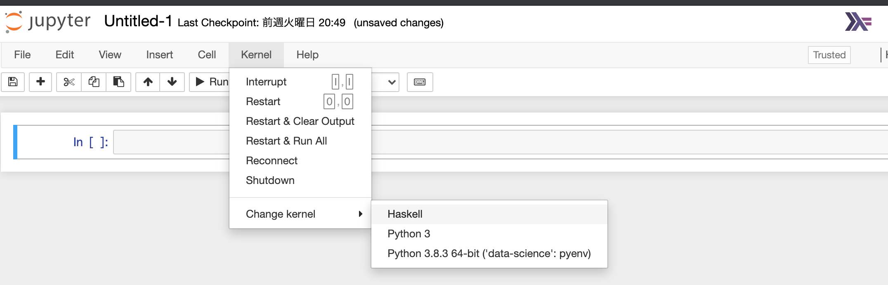

# [hasktorch100Exercises](https://www.notion.so/100-Exercises-for-Hasktorch-Tensor-a6aa7143fb334eabacda140fdaa0bae4)
This is Hasktorch ver. of numpy-100 practice.


## Getting Started
1. Please clone (or fork) this repository.

### Use Docker for hasktorch-jupyter
2. Pull [hasktorch-jupyter](https://hub.docker.com/repository/docker/htorch/hasktorch-jupyter) mounting
   ```
   docker pull htorch/hasktorch-jupyter:latest
   ```
3. Run the container and mount ipynb in this repository
   ```
   docker run -it --rm -p 8888:8888 htorch/hasktorch-jupyter /absolute/path/to/Hasktorch100Exercises:/home/ubuntu/Hasktorch100Exercises htorch/hasktorch-jupyter:latest-cpu
   ```
   
### [WIP]Install all dependencies
2. Install following libraries
  - [IHaskell](https://github.com/gibiansky/IHaskell)
  - [hasktorch](https://github.com/hasktorch/hasktorch)
  - [hasktorch-tools](https://github.com/DaisukeBekki/hasktorch-tools)

3. Rewrite path to hasktorch and hasktorch-tools in `stack.yaml`.

4. Start Jupyter Notebook
`stack exec jupyter -- notebook`

5. Select Haskell kernel


