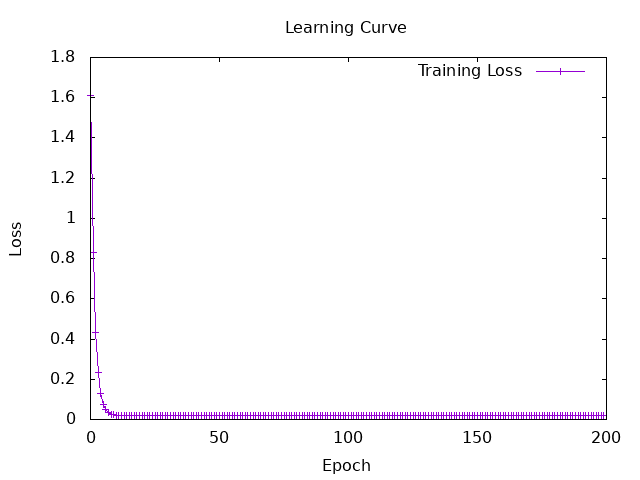
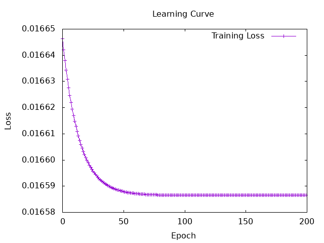

# Result of admit

## training curve


## eval curve


### Result
<br><br>
```haskell
Predictions: [0.71674776,0.7167036,0.7169782,0.71639144,0.71652055,0.7165026,
0.7165339,0.716536,0.7164024,0.71664774,0.7164554,0.71662134,0.716666,
0.71686256,0.7164226,0.7163249,0.7163464,0.71635664,0.71653306,0.71680677,
0.71670306,0.71644956,0.71692955,0.71643734,0.71664673,0.71656966,0.71670556,
0.71668524,0.71641994,0.716543,0.7163836,0.7165108,0.7166964,0.71664035,0.7165028,
0.7164086,0.71642566,0.7168807,0.7166437,0.71738636,0.716509,0.71652013,
0.7165221,0.7164173,0.71649694,0.71646154,0.7166869,0.71757555,0.7164548,0.7166381]

Targets: [0.82,0.89,0.93,0.73,0.71,0.59,0.51,0.37,0.69,0.89,0.77,0.68,0.62,0.57,0.45,0.54,0.71,0.78,0.81,0.86,0.87,0.64,0.9,0.67,0.67,0.59,0.62,0.65,0.71,0.79,0.8,0.78,0.83,0.71,0.73,0.7,0.68,0.79,0.76,0.65,0.67,0.54,0.53,0.62,0.68,0.87,0.96,0.93,0.73,0.84]
```

<br> converge to the same value, whatever i do.


