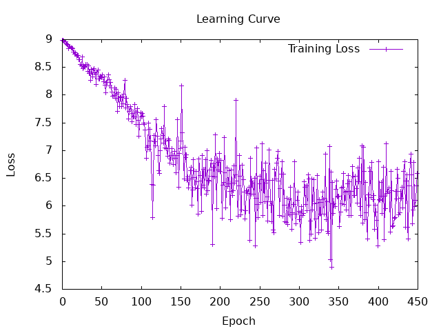

# Result of word2vec

## animated training curve


I got a lot of noises, because i downloaded wikipedia and convert it from xml to txt (https://linguatools.org/tools/corpora/wikipedia-monolingual-corpora/ and https://www.dropbox.com/scl/fi/wr86qtb1hnzht69b0k5xk/xml2txt.pl?rlkey=ec3tdcyrhj2ozhyt7koxhhb0p&e=1&dl=0) 
<br> And so, I have some part like that in my sample that make no sense.

```text
Oulu (Finland) 191,050
Turku (Finland) 180,350
Other important ports:
Estonia:
Pärnu 44,568
Maardu 16,570
Sillamäe 16,567
Finland:
Pori 83,272
```

## curve for the 500th first batches



Again same thing I guess.
<br>

## Others

- Optimizer: tested both Gradient Descent (GD) and Adam.
- Subsampling of frequent words to speed up training.